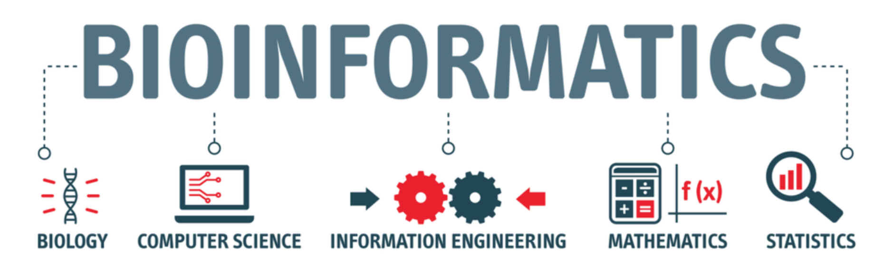

 
# A Collection of Bioinformatics Learning/Training Materials

**Preface**

**1.** Here is a curated list of **bioinformatics learning/training materials**, which are:

 - from university & institution training courses (preferably with a GitHub/GitLab repository), or
 - shared via an online registry, e.g ELIXIR's TeSS, GOBLET portal, OER commons etc; and
 - free to use and relatively sufficient for self-learning. 

**2.** We broadly organize the materials into five main categories of bioinformatics skills. Click the links below for more detailed lists in each category, including some brief notes to the courses. 

 
Any contribution to this list is highly appreciated.
 

## Table of Contents 
- [Scripting and programming languages](sections/scripting-and-programming-languages.md#scripting-and-programming-languages)
  - [UNIX shell](sections/scripting-and-programming-languages.md#unix-shell)
  - [Python](sections/scripting-and-programming-languages.md#python)
  - [R](sections/scripting-and-programming-languages.md#r)
- [Next-generation sequencing (NGS)](sections/next-generation-sequencing-ngs.md#next-generation-sequencing-ngs)
  - [General](sections/next-generation-sequencing-ngs.md#general)
  - [RNA-seq](sections/next-generation-sequencing-ngs.md#rna-seq)
  - [ChIP-seq](sections/next-generation-sequencing-ngs.md#chip-seq)
  - [ATAC-seq](sections/next-generation-sequencing-ngs.md#atac-seq)  
  - [Single cell](sections/next-generation-sequencing-ngs.md#single-cell)
  - [Spatial Transcriptomics](sections/next-generation-sequencing-ngs.md#spatial-transcriptomics)
  - [Genome assembly and annotation](sections/next-generation-sequencing-ngs.md#genome-assembly-and-annotation) 
  - [Variant analysis](sections/next-generation-sequencing-ngs.md#variant-analysis)
  - [Proteomics](sections/next-generation-sequencing-ngs.md#proteomics)
  - [Enrichment analysis](sections/next-generation-sequencing-ngs.md#enrichment-analysis)
  - [Pathway analysis](sections/next-generation-sequencing-ngs.md#pathway-analysis)
  - [Public data](sections/next-generation-sequencing-ngs.md#public-data)
- [Computational environments and pipelines](sections/computational-environments-and-pipelines.md#computational-environments-and-pipelines)
  - [High performance computing](sections/computational-environments-and-pipelines.md#high-performance-computing)
  - [Containers](sections/computational-environments-and-pipelines.md#containers)
- [Data analysis, statistics and machine learning](sections/data-analysis-statistics-and-machine-learning.md#data-analysis-statistics-and-machine-learning)
  - [Statistics](sections/data-analysis-statistics-and-machine-learning.md#statistics)
  - [Machine learning](sections/data-analysis-statistics-and-machine-learning.md#machine-learning)
  - [Miscellaneous](sections/data-analysis-statistics-and-machine-learning.md#miscellaneous)
- [Reproducibility and data management](sections/reproducibility-and-data-management.md#reproducibility-and-data-management)
  - [Version control](sections/reproducibility-and-data-management.md#git)
  - [Reproducible research](sections/reproducibility-and-data-management.md#reproducible-research)
  - [Data management](sections/reproducibility-and-data-management.md#data-management)
- [Other collections of bioinformatics resources](sections/other-collections.md#other-collections-of-bioinformatics-resources)
  - [Institutions](sections/other-collections.md#institutions)
  - [Online registry/training portals](sections/other-collections.md#online-registrytraining-portals)
  - [Miscellaneous](sections/other-collections.md#miscellaneous)

 
